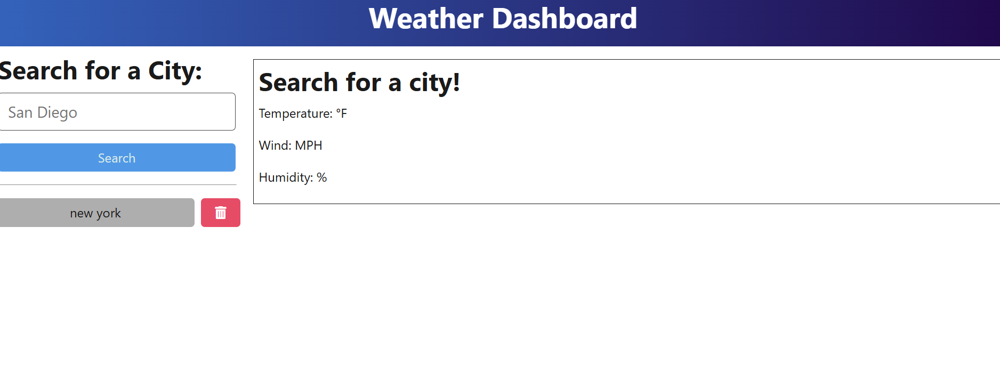
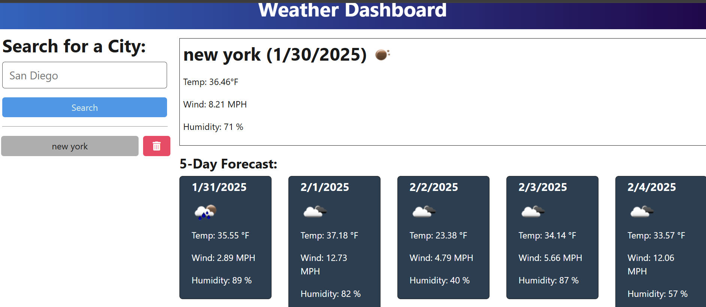

# Weather-Forecast

## Description

This project is helping understand the concepts of working with API's. The reason behind this is to get some practice working with the front end and the back end. Making these two work together properly will help the user retrieve data appropriately. This project helps usability for user when they are searching for the weather forecast in a specific city. I was able to learn how to try to tie the front end and the back end together. Without the proper information of either, the app would not work appropriately for the user. It helped me get more practice in to work each method appropriately and reading and udnerstanding what eahc method is doing. 

## Table of Contents 

- [Installation](#installation)
- [Usage](#usage)
- [Credits](#credits)
- [License](#license)

## Installation

These will be the following downloads/ installations that will be necessary. For starters, these libraries will need to be downloaded onto your computer. VS Code, or some sort of code editor, will need to be downloaded as well. Inside the code editor, you will need the Inquirer package downloaded. Running "npm i" in the command terminal will install all the node modules you will need. 

## Usage

In order for this project to work properly, you will need to download the libraries onto your local device for use with your code editor. In the code editor, you will open up a terminal and begin installing the node modules. To begin using the application type "npm run build" into the terminal. After this begins you will run "npm run start:dev". This command should begin running the site on your local device.
  
## Credits

## License

MIT License

Copyright (c) [2025] [Evelin Robles]

Permission is hereby granted, free of charge, to any person obtaining a copy
of this software and associated documentation files (the "Software"), to deal
in the Software without restriction, including without limitation the rights
to use, copy, modify, merge, publish, distribute, sublicense, and/or sell
copies of the Software, and to permit persons to whom the Software is
furnished to do so, subject to the following conditions:

The above copyright notice and this permission notice shall be included in all
copies or substantial portions of the Software.

THE SOFTWARE IS PROVIDED "AS IS", WITHOUT WARRANTY OF ANY KIND, EXPRESS OR
IMPLIED, INCLUDING BUT NOT LIMITED TO THE WARRANTIES OF MERCHANTABILITY,
FITNESS FOR A PARTICULAR PURPOSE AND NONINFRINGEMENT. IN NO EVENT SHALL THE
AUTHORS OR COPYRIGHT HOLDERS BE LIABLE FOR ANY CLAIM, DAMAGES OR OTHER
LIABILITY, WHETHER IN AN ACTION OF CONTRACT, TORT OR OTHERWISE, ARISING FROM,
OUT OF OR IN CONNECTION WITH THE SOFTWARE OR THE USE OR OTHER DEALINGS IN THE
SOFTWARE.

## Tests

If everyhting runs correctly your default browser will open up and show somehting similar to the following:

Once you enter a city, the weather details will show up:

